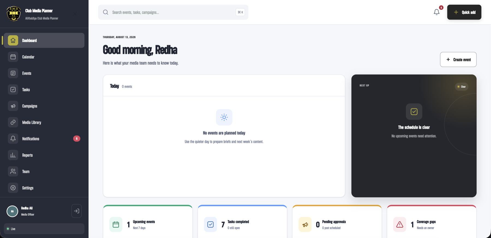
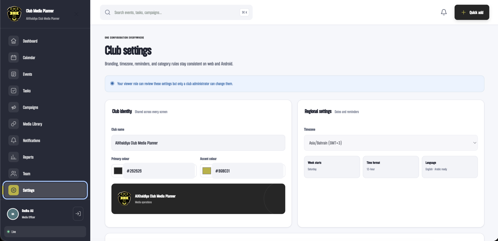
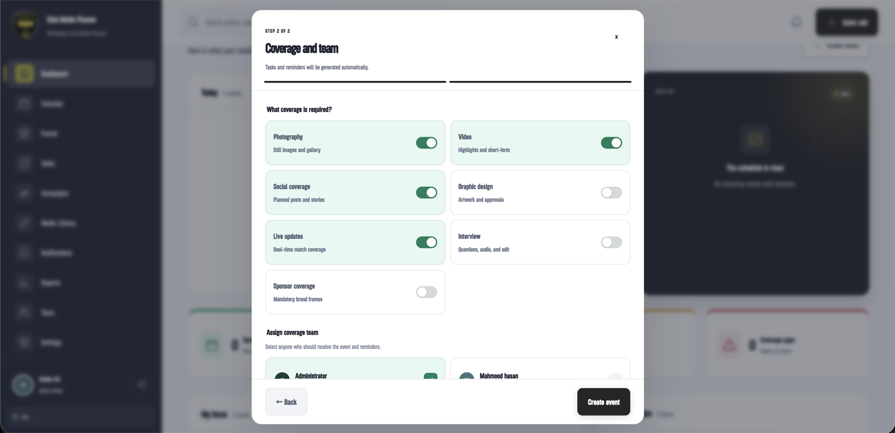
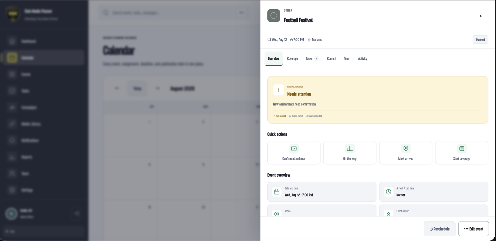
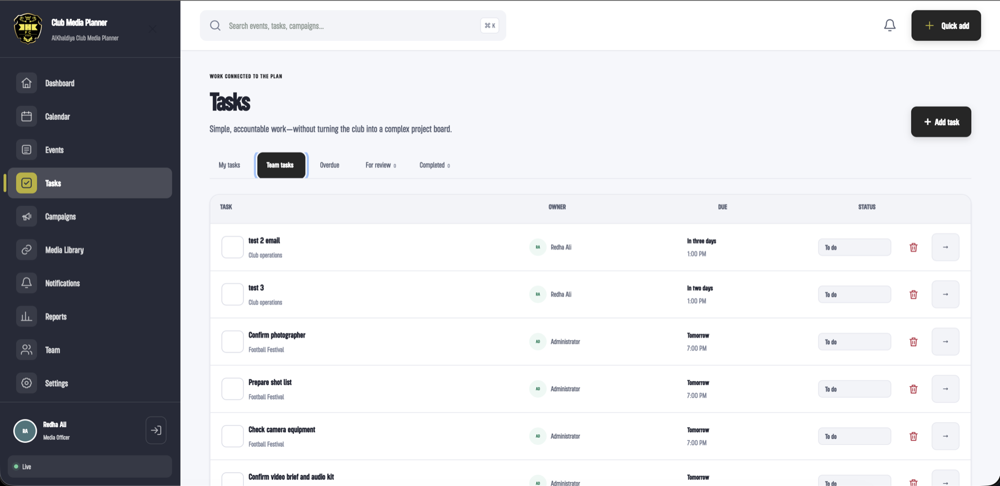

# Project Workspace

Project Workspace is a focused, self-hosted project-management system for any team.
It gives administrators, managers, team leads, contributors, reviewers, and viewers one
shared view of what is happening, who owns it, what is required, and what is still at risk.

## What is included

- Responsive dashboard, calendar, milestones, tasks, projects, deliverables, external
  links, notifications, reports, team, and settings.
- Username-or-email sign-in and configurable SMTP notifications with responsive HTML
  templates, plain-text fallbacks, delivery retries, and per-user preferences.
- Fast two-step milestone creation with automatic task suggestions and four default
  reminder windows.
- Milestone workspaces with readiness, assignments, requirements, checklists,
  resources, comments, deliverables, and activity history.
- A self-contained Hostinger edition with a same-host PHP API, locked JSON storage,
  role checks, CSRF protection, login lockout, and idempotent mutations.
- An installable PWA with an offline shell, queued field updates, and Android-ready
  navigation.
- Clean first-run production data: one temporary administrator, configurable
  categories, and no demo milestones, tasks, projects, deliverables, or links.
- Link-only file records. The workspace does not accept photo, video, or document
  uploads.
- A PHP cron worker sends assignments, changes, and reminders while every
  browser is closed.

## Product tour

The interface below shows Project Workspace configured for a sports media team.
Administrators can replace the organization name, logos, colors, timezone, categories,
and operating defaults for any type of team. Click any preview to view it full size.

| Branding and workspace settings | Guided event creation |
| :---: | :---: |
|  |  |
| **Configurable branding and regional defaults** | **Fast creation with automatic tasks and reminders** |

| Event workspace | Team task management |
| :---: | :---: |
|  |  |
| **Readiness, assignments, content, and activity in one workspace** | **Clear ownership, deadlines, reviews, and completion states** |

## No-software use

[Download the ready-to-upload Hostinger package](Hostinger-Upload-Project-Workspace.zip),
upload it to `public_html`, and extract it. The deployment does not need npm, Node.js,
Android Studio, a database, or an external application server. Follow
[HOSTINGER-UPLOAD.md](HOSTINGER-UPLOAD.md).

On Android, open the hosted URL in Chrome and choose **Install app**. The installed PWA
provides the complete mobile interface without Android Studio or APK sideloading.

## Project map

- `app/` — interface
- `hostinger-backend/` — same-host PHP API and protected JSON storage rules
- `hostinger-web/` — production web entry point and local preview adapter
- `Hostinger-Upload-Project-Workspace.zip` — complete installation package for `public_html`
- `public/` — installable/offline assets
- `android/` — optional native Android wrapper source
- `HOSTINGER-UPLOAD.md` — upload, update, backup, and recovery steps
- `tests/` — release checks

The product name, organization name, colors, logos, timezone, reminder defaults, categories, and
other operating settings are configurable rather than embedded in individual screens.
